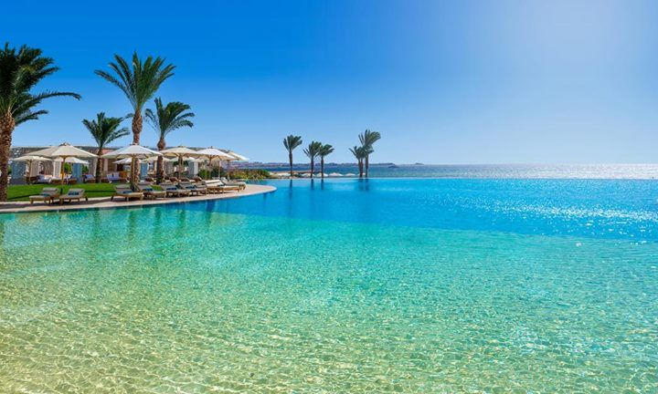
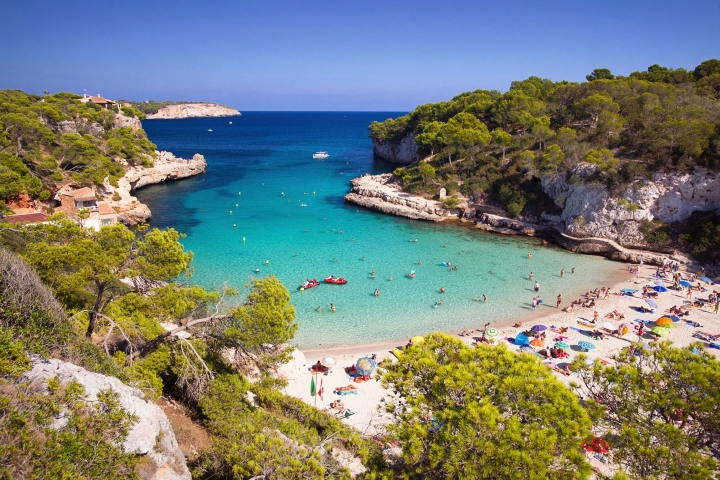

# 🏖 Мой отпуск

## Поездки
---
Съездить в Турцию, Египет, Испанию.

<video width="720" height="432" controls="controls">
  <source src="Antaly.mov" type="video/mp4">
</video>

## Мероприятия
---
Сходить на экскурсии по достопримечательностям

## Планы
---
1. Посетить пляжи в Турции, Египте, Испании.
2. Поплавать в Средиземном море.
3. Позагорать на солнышке.
4. Насладиться потрясающими видами: снежные горы, выглядывающее из-под туманного заслона, бескрайнее море и пальмы.
5. Увидеть редкие виды животных.
6. Приобрести сувенир.
7. Прогуляться по ночному отелю.

## Отдых дома
---
1. Посмотреть лучший художественный фильм
2. Приготовить пирог, пригласить друзей
3. Спеть в караоке
4. Сыграть в видеоигру
5. Записать вокал в программе Magix Sound Forge Pro, наложить музыкальную композицию
